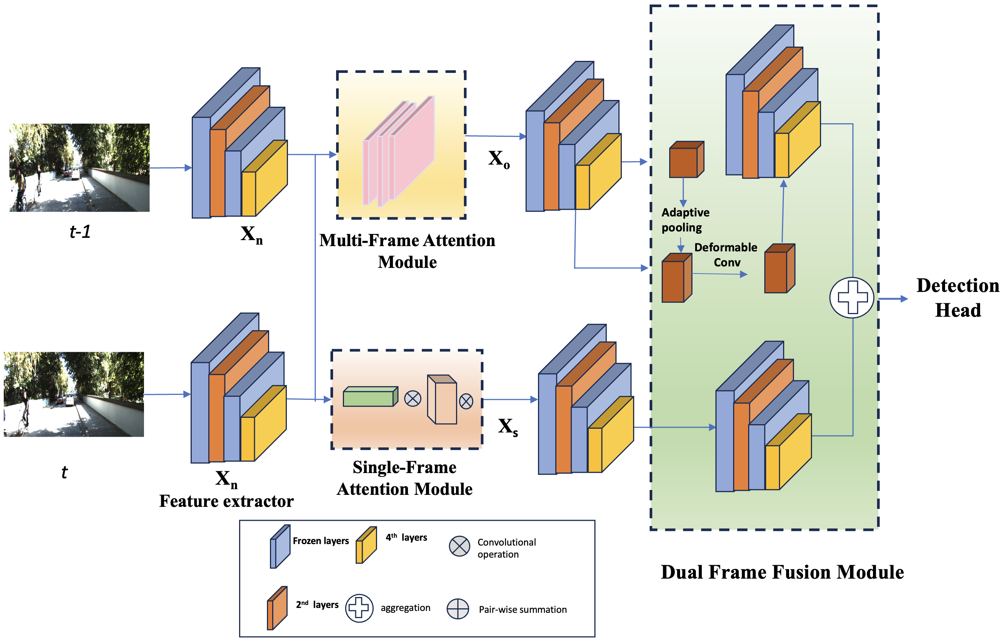

#Spatio-temporal object detection; feature fusion; spatio-temporal attention
  <div align="center">
    <b><font size="5">OpenMMLab website</font></b>
    <sup>
      <a href="https://openmmlab.com">
        <i><font size="4">HOT</font></i>
      </a>
    </sup>
    &nbsp;&nbsp;&nbsp;&nbsp;
    <b><font size="5">OpenMMLab platform</font></b>
    <sup>
      <a href="https://platform.openmmlab.com">
        <i><font size="4">TRY IT OUT</font></i>
      </a>
    </sup>
  </div>
  <div>&nbsp;</div>
<div align="center">
  
  <div>&nbsp;</div>
[](https://pypi.org/project/mmdet)
[](https://mmdetection.readthedocs.io/en/latest/)
[](https://github.com/open-mmlab/mmdetection/actions)
[](https://codecov.io/gh/open-mmlab/mmdetection)
[](https://github.com/open-mmlab/mmdetection/blob/main/LICENSE)
[](https://github.com/open-mmlab/mmdetection/issues)
[](https://github.com/open-mmlab/mmdetection/issues)
[](https://openxlab.org.cn/apps?search=mmdet)

[📘Documentation](https://mmdetection.readthedocs.io/en/latest/) |
[🛠️Installation](https://mmdetection.readthedocs.io/en/latest/get_started.html) |
[👀Model Zoo](https://mmdetection.readthedocs.io/en/latest/model_zoo.html) |
[🆕Update News](https://mmdetection.readthedocs.io/en/latest/notes/changelog.html) |
[🚀Ongoing Projects](https://github.com/open-mmlab/mmdetection/projects) |
[🤔Reporting Issues](https://github.com/open-mmlab/mmdetection/issues/new/choose)

</div>

<div align="center">

English | [简体中文](README_zh-CN.md)

</div>


## Introduction

STF module is the Fusion Module for Improving Video Object Detection
a part of the [OpenMMLab](https://openmmlab.com/) project.

The main branch works with **PyTorch 1.8+**.


## Installation

Please refer to [Installation](https://mmdetection.readthedocs.io/en/latest/get_started.html) for installation instructions.

## Getting Started

Please see [Overview](https://mmdetection.readthedocs.io/en/latest/get_started.html) for the general introduction of MMDetection.

For detailed user guides and advanced guides, please refer to our [documentation](https://mmdetection.readthedocs.io/en/latest/):

- User Guides

  <details>

  - [Train & Test](https://mmdetection.readthedocs.io/en/latest/user_guides/index.html#train-test)
    - [Learn about Configs](https://mmdetection.readthedocs.io/en/latest/user_guides/config.html)
    - [Inference with existing models](https://mmdetection.readthedocs.io/en/latest/user_guides/inference.html)
    - [Dataset Prepare](https://mmdetection.readthedocs.io/en/latest/user_guides/dataset_prepare.html)
    - [Test existing models on standard datasets](https://mmdetection.readthedocs.io/en/latest/user_guides/test.html)
    - [Train predefined models on standard datasets](https://mmdetection.readthedocs.io/en/latest/user_guides/train.html)
    - [Train with customized datasets](https://mmdetection.readthedocs.io/en/latest/user_guides/train.html#train-with-customized-datasets)
    - [Train with customized models and standard datasets](https://mmdetection.readthedocs.io/en/latest/user_guides/new_model.html)
    - [Finetuning Models](https://mmdetection.readthedocs.io/en/latest/user_guides/finetune.html)
    - [Test Results Submission](https://mmdetection.readthedocs.io/en/latest/user_guides/test_results_submission.html)
    - [Weight initialization](https://mmdetection.readthedocs.io/en/latest/user_guides/init_cfg.html)
    - [Use a single stage detector as RPN](https://mmdetection.readthedocs.io/en/latest/user_guides/single_stage_as_rpn.html)
    - [Semi-supervised Object Detection](https://mmdetection.readthedocs.io/en/latest/user_guides/semi_det.html)
  - [Useful Tools](https://mmdetection.readthedocs.io/en/latest/user_guides/index.html#useful-tools)

  </details>

- Advanced Guides

  <details>

  - [Basic Concepts](https://mmdetection.readthedocs.io/en/latest/advanced_guides/index.html#basic-concepts)
  - [Component Customization](https://mmdetection.readthedocs.io/en/latest/advanced_guides/index.html#component-customization)
  - [How to](https://mmdetection.readthedocs.io/en/latest/advanced_guides/index.html#how-to)

  </details>

We also provide object detection colab tutorial [](demo/MMDet_Tutorial.ipynb) and instance segmentation colab tutorial [](demo/MMDet_InstanceSeg_Tutorial.ipynb).


## FAQ

Please refer to [FAQ](docs/en/notes/faq.md) for frequently asked questions.

## Contributing

We appreciate all contributions to improve MMDetection. Ongoing projects can be found in out [GitHub Projects](https://github.com/open-mmlab/mmdetection/projects). Welcome community users to participate in these projects. Please refer to [CONTRIBUTING.md](.github/CONTRIBUTING.md) for the contributing guideline.

## Acknowledgement

MMDetection is an open source project that is contributed by researchers and engineers from various colleges and companies. We appreciate all the contributors who implement their methods or add new features, as well as users who give valuable feedbacks.
We wish that the toolbox and benchmark could serve the growing research community by providing a flexible toolkit to reimplement existing methods and develop their own new detectors.

## Citation

If you use this toolbox or benchmark in your research, please cite this project.

```
@article{mmdetection,
  title   = {{MMDetection}: Open MMLab Detection Toolbox and Benchmark},
  author  = {Chen, Kai and Wang, Jiaqi and Pang, Jiangmiao and Cao, Yuhang and
             Xiong, Yu and Li, Xiaoxiao and Sun, Shuyang and Feng, Wansen and
             Liu, Ziwei and Xu, Jiarui and Zhang, Zheng and Cheng, Dazhi and
             Zhu, Chenchen and Cheng, Tianheng and Zhao, Qijie and Li, Buyu and
             Lu, Xin and Zhu, Rui and Wu, Yue and Dai, Jifeng and Wang, Jingdong
             and Shi, Jianping and Ouyang, Wanli and Loy, Chen Change and Lin, Dahua},
  journal= {arXiv preprint arXiv:1906.07155},
  year={2019}
}
```

## License

This project is released under the [Apache 2.0 license](LICENSE).


