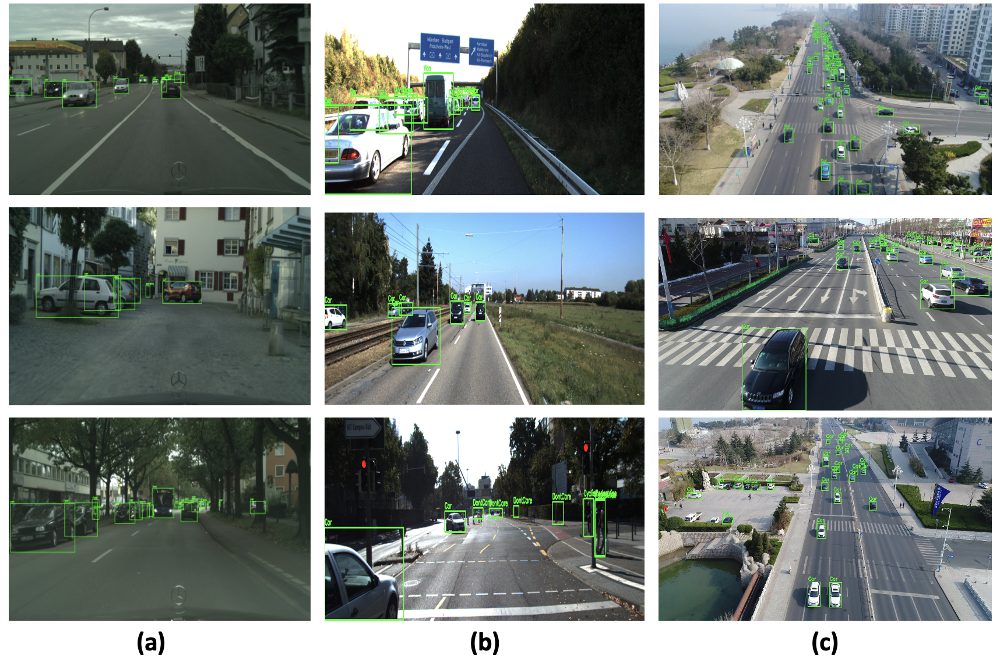
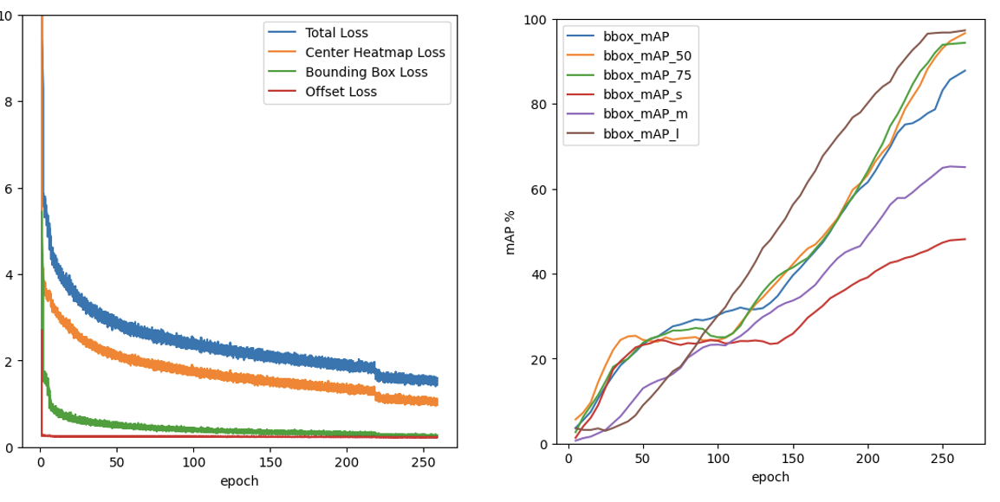

# **STF: Spatio-Temporal Fusion Module for Improving Video Object Detection **

  

    <b>OpenMMLab website</b>
    
      <a href="https://openmmlab.com">
        <i>HOT</i>
      </a>
    
    &nbsp;&nbsp;&nbsp;&nbsp;
    <b>OpenMMLab platform</b>
    
      <a href="https://platform.openmmlab.com">
        <i>TRY IT OUT</i>
      </a>
    
  

  
&nbsp;

  
  
&nbsp;

[📘Documentation](https://mmdetection.readthedocs.io/en/latest/) |
[🛠️Installation](https://mmdetection.readthedocs.io/en/latest/get_started.html) |

English | [简体中文](README_zh-CN.md)

## Introduction

STF module is the Fusion Module for Improving Video Object Detection and it is a part of the [OpenMMLab](https://openmmlab.com/) project.

The main branch works with **PyTorch 1.8+**.

## Installation

Please refer to [Installation](https://mmdetection.readthedocs.io/en/latest/get_started.html) for installation instructions.

## Getting Started

Please see [Overview](https://mmdetection.readthedocs.io/en/latest/get_started.html) for the general introduction of MMDetection.
You need to follow the steps defined in the docs.
To train the model, use the following command:

python tools/train configs/centernet/hrnet.py 

For detailed user guides and advanced guides, please refer to our [documentation](https://mmdetection.readthedocs.io/en/latest/):

- User Guides

  

  - [Train & Test](https://mmdetection.readthedocs.io/en/latest/user_guides/index.html#train-test)
    - [Learn about Configs](https://mmdetection.readthedocs.io/en/latest/user_guides/config.html)
    - [Inference with existing models](https://mmdetection.readthedocs.io/en/latest/user_guides/inference.html)
    - [Dataset Prepare](https://mmdetection.readthedocs.io/en/latest/user_guides/dataset_prepare.html)
    - [Test existing models on standard datasets](https://mmdetection.readthedocs.io/en/latest/user_guides/test.html)
    - [Train predefined models on standard datasets](https://mmdetection.readthedocs.io/en/latest/user_guides/train.html)
    - [Train with customized datasets](https://mmdetection.readthedocs.io/en/latest/user_guides/train.html#train-with-customized-datasets)
    - [Train with customized models and standard datasets](https://mmdetection.readthedocs.io/en/latest/user_guides/new_model.html)
    - [Finetuning Models](https://mmdetection.readthedocs.io/en/latest/user_guides/finetune.html)
    - [Test Results Submission](https://mmdetection.readthedocs.io/en/latest/user_guides/test_results_submission.html)
    - [Weight initialization](https://mmdetection.readthedocs.io/en/latest/user_guides/init_cfg.html)
    - [Use a single-stage detector as RPN](https://mmdetection.readthedocs.io/en/latest/user_guides/single_stage_as_rpn.html)
    - [Semi-supervised Object Detection](https://mmdetection.readthedocs.io/en/latest/user_guides/semi_det.html)
  - [Useful Tools](https://mmdetection.readthedocs.io/en/latest/user_guides/index.html#useful-tools)

  

## Datasets
In this repo, we used the following datasets:
1) [KITTI MOTS Dataset](https://www.cvlibs.net/datasets/kitti/eval_mots.php)
2) [Cityscapes Dataset](https://www.cityscapes-dataset.com/benchmarks/#instance-level-scene-labeling-task)
3) [UAVDT Dataset](https://sites.google.com/view/daweidu/projects/uavdt)
## Results
These are the results on Cityscape, KITTI (MOT) and UAVDT.
 

  
&nbsp;

  
  
&nbsp;

  The graph for  training loss wrt to the Cityscapes dataset is as below:
 

  
&nbsp;

  
  
&nbsp;

## FAQ
Please refer to [FAQ](docs/en/notes/faq.md) for frequently asked questions.
## Acknowledgement
We acknowledge the support of the Natural Sciences and Engineering Research Council of Canada (NSERC),[funding reference number RGPIN-2020-04633].

## Citation
If you use this module in your research, please cite this project.

## License

This project is released under the [Apache 2.0 license](LICENSE).

